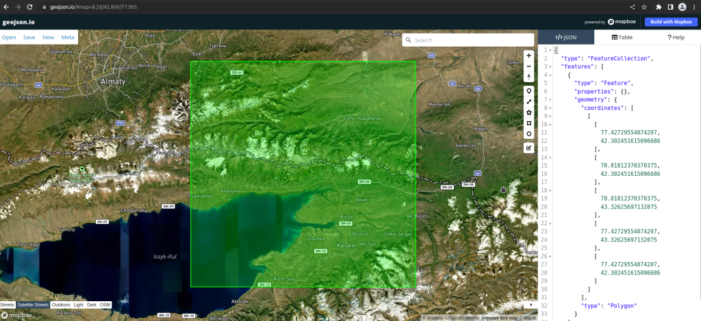
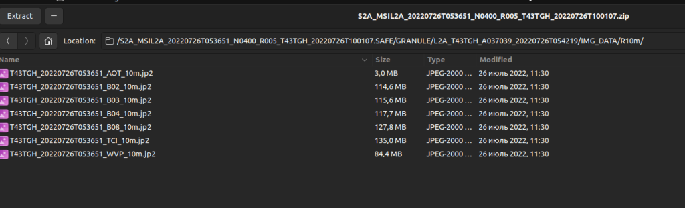
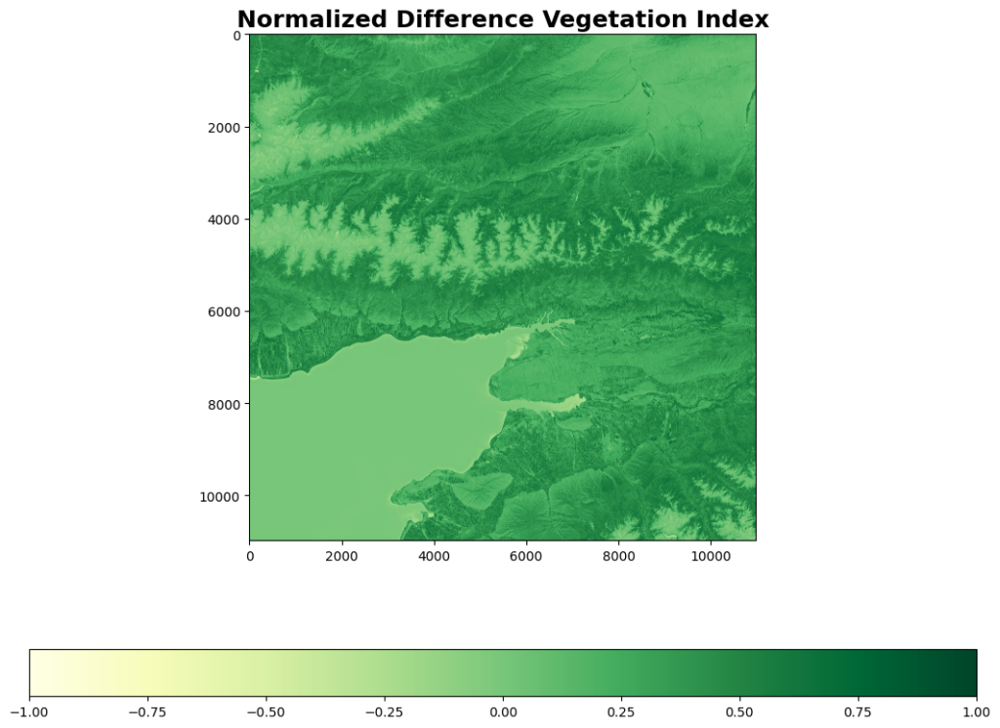
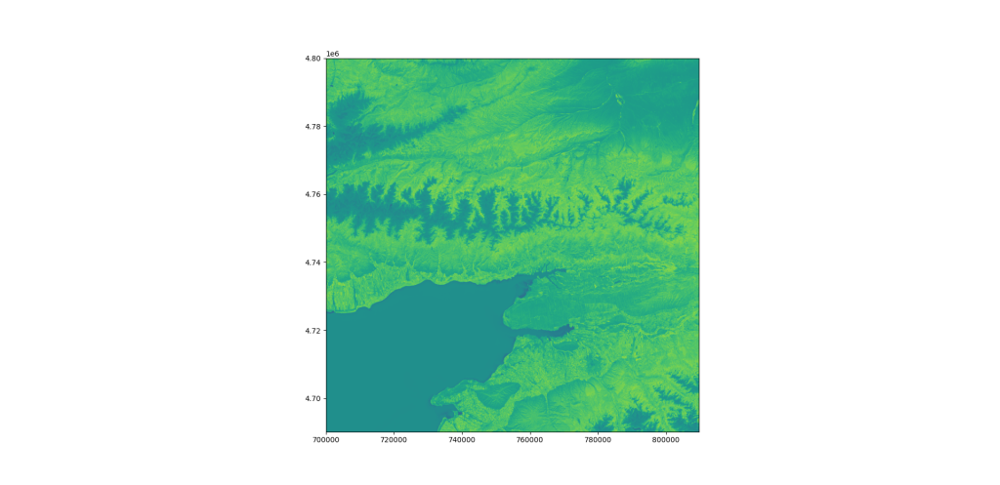
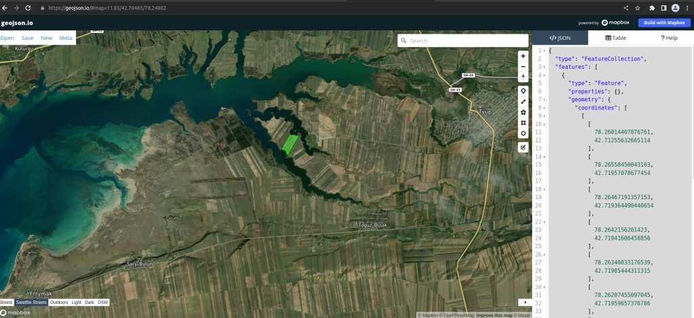
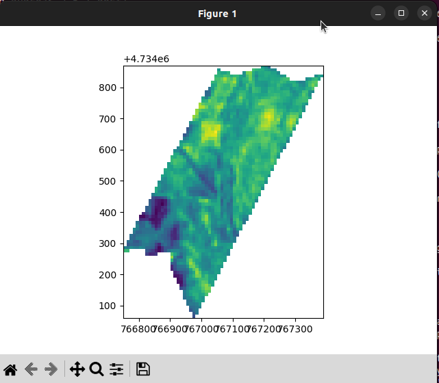
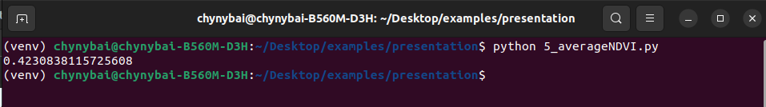
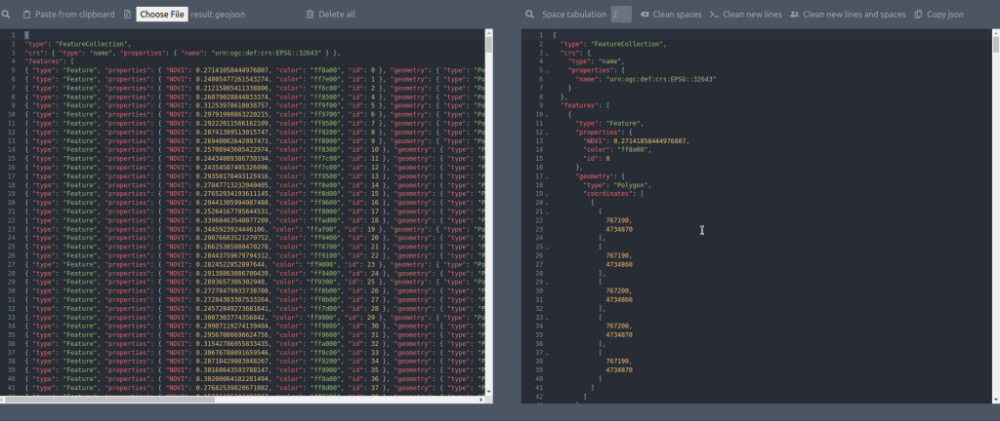
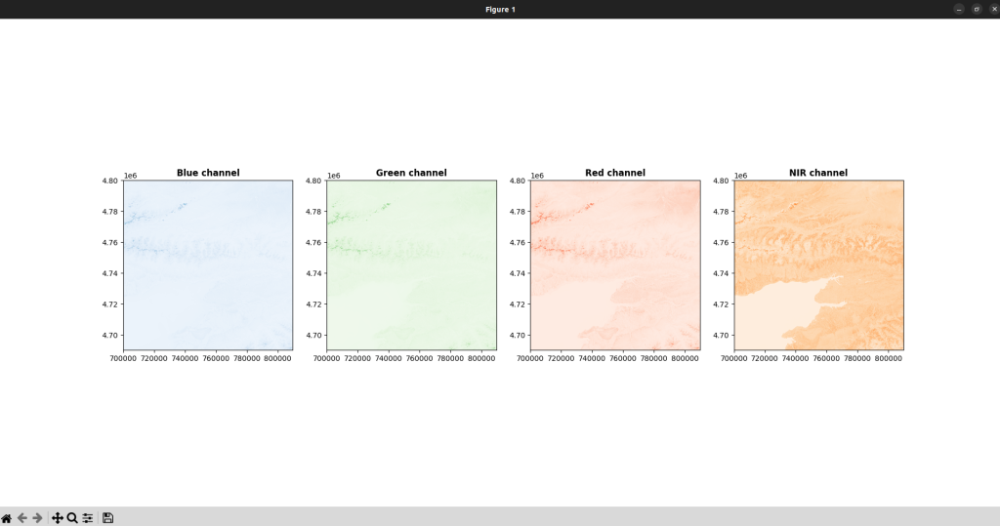

Методика вычисления индексов похожа. По этой причине мы рассмотрим только вариант получения данных по NDVI.

### Скачивание исходников

Для скачивания исходников космо снимка мы использовали 2 сайта:

```
https://scihub.copernicus.eu/dhus/#/home
https://apps.sentinel-hub.com/eo-browser/
```

Для презентации я скачал участок в Исык-кульской области из первого сайта:


Первый сайт выдаёт нам tiff файлы в формате jp2, а второй в формате tiff. 



## Требования
- Для обработки использовался язык Python 3.10.6
- Так же должен быть установлен локально. Без локально установленного Gdal не установится в виртуальном окружении.

Библиотеки:

```
Gdal
Rasterio
Matplotlib
Numpy
Geopandas
```

## Преобразование jp2 в tif

После установки этих библиотек создал фай 1_from_jp2_to_tiff.py в котором прописали следующий код:

```
import rasterio


path = "./images/"
files = [
    path + "B02.jp2",  # Blue
    path + "B03.jp2",  # Green
    path + "B04.jp2",  # Red
    path + "B08.jp2"   # NIR
]
src = rasterio.open(files[0])
meta = src.meta
meta.update(count=len(files))
meta.update(driver="GTiff")
with rasterio.open("output/sentinel2.tif", "w", **meta) as dst:
    for id, layer in enumerate(files, start=1):
        with rasterio.open(layer) as src:
            dst.write(src.read(1), id)
```

Результат этого скрипта: Переобразовывает файлы формата jp2 в один файл в формате tif. 

## Вычисление NDVI из полученого tif файла

Создал фай 2_calculatingNDVI.py в котором прописали следующий код:

```
import matplotlib.pyplot as plt
import numpy
import rasterio


image_file = "./output/sentinel2.tif"


with rasterio.open(image_file) as src:
    band_red = src.read(3)
    band_nir = src.read(4)


numpy.seterr(divide='ignore', invalid='ignore')


# Calculate NDVI
ndvi = (band_nir.astype(float) - band_red.astype(float)) / (band_nir + band_red)


min = numpy.nanmin(ndvi)
max = numpy.nanmax(ndvi)
mid = 0.1


fig = plt.figure(figsize=(20, 10))
ax = fig.add_subplot(111)


cmap = plt.cm.YlGn
cax = ax.imshow(ndvi, cmap=cmap, clim=(min, max), vmin=min, vmax=max)


ax.axis('on')
ax.set_title('Normalized Difference Vegetation Index', fontsize=18, fontweight='bold')


cbar = fig.colorbar(cax, orientation='horizontal', shrink=0.65)


ax.plot(20, 10)

plt.savefig('./output/result.png', bbox_inches='tight', transparent=True)
plt.show()
```

Результат этого скрипта: высчитывает NDVI получает картинку в формате png сохраняет.



## Сохранение NDVI в tiff файл

Следующий код на вход берёт преобразованный из jp2 файлов tiif файл который у нас называется sentinel2.tif из него считывает 2 слоя red, nir. Высчитывает индекс NDVI и сохраняет его в формате tiff для дальнейшего использования:

```
import numpy
import rasterio
from rasterio import plot
import matplotlib.pyplot as plt


image_file = "./output/sentinel2.tif"


with rasterio.open(image_file) as src:
    band_red = src.read(3)
    band_nir = src.read(4)


# Allow division by zero
numpy.seterr(divide='ignore', invalid='ignore')


#  Calculate NDVI
ndvi = (band_nir.astype(float) - band_red.astype(float)) / (band_nir + band_red)


# Set spatial characteristics of the output object to mirror the input
kwargs = src.meta
kwargs.update(
    dtype=rasterio.float32,
    count=1,
    )


# Create the file
with rasterio.open('./output/2ndvi.tiff', 'w', **kwargs) as dst:
    dst.write_band(1, ndvi.astype(rasterio.float32))
```

результат выглядит:

Следующий шаг это вырезаем конкретный участок. Для этого на сайте [geojson.io](http://geojson.io) выделил участок и сохранил в файле cords.geojson:



```
{
    "type": "FeatureCollection",
    "features": [
      {
        "type": "Feature",
        "properties": {},
        "geometry": {
          "coordinates": [
            [
              [
                78.26014407876761,
                42.71255632665114
              ],
              [
                78.26558450043103,
                42.71957078677454
              ],
              [
                78.26467191357153,
                42.719364490440654
              ],
              [
                78.2642156201423,
                42.71941606458856
              ],
              [
                78.26340833176539,
                42.71985444311315
              ],
              [
                78.26207455097045,
                42.71959657376786
              ],
              [
                78.26147785956249,
                42.71980286932967
              ],
              [
                78.25740631818894,
                42.71459369640152
              ],
              [
                78.25828380555345,
                42.714722641603316
              ],
              [
                78.25835400454343,
                42.714490540046654
              ],
              [
                78.25937188988689,
                42.71456790732867
              ],
              [
                78.25930169089679,
                42.714155280710315
              ],
              [
                78.26014407876761,
                42.71255632665114
              ]
            ]
          ],
          "type": "Polygon"
        }
      }
    ]
  }
  
```

После этого создал файл 4_cutting.py в котором прописал код:

```
from osgeo import gdal


def cutting_tiff(outputpath, inputpath, polygon):
    gdal.Warp(destNameOrDestDS=f'{outputpath}',
              srcDSOrSrcDSTab=inputpath,
              cutlineDSName=f'{polygon}',
              cropToCutline=True,
              copyMetadata=True,
              dstNodata=0)


cutting_tiff(outputpath='./output/cuttedNDVI.tiff', inputpath='./output/2ndvi.tiff', polygon='./cords.geojson')
```

результат этого скрипта обрезал из tiff файла 2ndvi.tiff заданный участок:



### Высчитывание среднего показателя NDVI по заданному участку

На данный момент у нас есть tiff файл с высчитанным NDVI и для вычисления среднего показателя использовал ниже указанный код:

```
import numpy as np
import rasterio


def get_region_of_interest(ndvi, multiplier=1/2):

    # undo the background adjustment
    region = ndvi.copy()
    region = np.where(region == -255, 0, region)

    # mean of center rows
    center_row1 = np.mean(region[int((multiplier) *len(region))])
    center_row2 = np.mean(region[int((multiplier) *len(region))+1])

    # mean of both rows
    mean = (center_row1.copy()+center_row2.copy())/2
    return mean


my_file = rasterio.open('./output/2ndvi.tiff')
ndvi = my_file.read(1).astype('float64')


print(get_region_of_interest(ndvi=ndvi))
```

Результат данного скрипта:



### Преобразование из tiff в geojson

Для этого понадобиться библиотека geopandas. Скрипт принимает файл который был обрезан по заданному участку (cuttedNDVI.tiff) и выдаёт как результат geojson файл  в котором прописанны координаты и показатель индекса конкретного координата. Коде го выглядит следующим образом:

```
import time
from colorsys import hsv_to_rgb
import geopandas as gp
import rasterio
from rasterio.features import shapes


start = time.time()


tiff_name = './output/cuttedNDVI.tiff'
data = rasterio.open(tiff_name).meta


c = str(data['crs'])
c_s = c.split(':')


mask = None
with rasterio.open(tiff_name) as src:
    image = src.read(1)  # first band
    results = (
    {'properties': {'NDVI': v}, 'geometry': s}
    for i, (s, v) in enumerate(shapes(image, mask=mask, transform=data['transform'])))


geoms = list(results)


gpd_polygonized_raster = gp.GeoDataFrame.from_features(geoms, crs=c)


gpd_polygonized_raster = gpd_polygonized_raster[gpd_polygonized_raster['NDVI']>0]


def pseudocolor(val, minval, maxval):
    """ Convert val in range minval..maxval to the range 0..120 degrees which
        correspond to the colors Red and Green in the HSV colorspace.
    """
    h = (float(val-minval) / (maxval-minval)) * 120

    # Convert hsv color (h,1,1) to its rgb equivalent.
    # Note: hsv_to_rgb() function expects h to be in the range 0..1 not 0..360
    r, g, b = hsv_to_rgb(h/360, 1., 1.)
    return int(r*255), int(g*255), int(b*255)


minval = 0
maxval = 1


def rgb_to_hex(rgb):
    return '%02x%02x%02x' % rgb


for i, row in gpd_polygonized_raster.iterrows():
  gpd_polygonized_raster.loc[i, ('color')] = rgb_to_hex(pseudocolor(row['NDVI'], minval, maxval))
  gpd_polygonized_raster['id'] = gpd_polygonized_raster.index


crs_sys = 'epsg:' + c_s[1]
gpd_polygonized_raster['geometry'] = gpd_polygonized_raster['geometry'].to_crs({'init': crs_sys})
gpd_polygonized_raster.to_file('result.geojson', driver='GeoJSON')
print(time.time() - start)
```

Результат:



### Посмотреть все слои tiff файла

Код данного действия:

```
import rasterio
from rasterio.plot import show
import matplotlib.pyplot as plt


image_file = "./output/sentinel2.tif"
src = rasterio.open(image_file)
fig, (axb, axg, axr, axn) = plt.subplots(1,4, figsize=(24,8))
show((src, 1), ax=axb, cmap='Blues', title='Blue channel')
show((src, 2), ax=axg, cmap='Greens', title='Green channel')
show((src, 3), ax=axr, cmap='Reds', title='Red channel')
show((src, 4), ax=axn, cmap='Oranges', title='NIR channel')
plt.show()
```

при запуске этого кода результат будет следующим:


